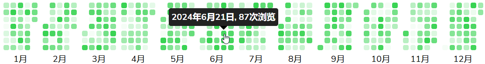

# yearrecord
A react component that displays data for each day of the year


## install
```
npm install yearrecord
```

## use

In a React project, you can use it like this:
```jsx
import YearRecord from "yearrecord"

function App() {

  return (
    <>
      <YearRecord
        themeColor="green"
        tooltipTitileFunc={item => `${item.year}年${item.month}月${item.day}日, ${item.data}次浏览`}
      ></YearRecord>
    </>
  )
}

export default App
```
then you will see:


## API

### API of YearRecord

|         prop          |   type   |     default value      |                         description                          |
| :-------------------: | :------: | :--------------------: | :---------------------------------------------------------- |
|       itemWidth       |  string  |         “10px”         |            width of div of the single day record             |
|      itemHeight       |  string  |         "10px"         |            height of div of the single day record            |
|   itemBorderRadius    |  string  |         "3px"          |      border-radius of the div of the single day record       |
|      gridRowGap       |  string  |         "3px"          |                 row gap, used in grid layout                 |
|     gridColumnGap     |  string  |         "3px"          |               column gap, used in grid layout                |
|         year          |  number  |      current year      |                       year of the data                       |
|         data          |  Array   |    random generate     | the data to display,  it's format is up to the prop `compact`. If `compact === true`, `data` is an `Array` of length `n`,  and the i-th item is the data of  month `i+1`, the length of month data is up to the count of days of that month, then format of  a single day record is: `{yaer: number, month: number, day:number, data: number}`; if `compact === false`，`data` will be an `Array` of length `n`，  it conatins `n` single day records. In other words, `data` is a 2-d array if `compact === true`, else `data` is a 1-d array. |
|      themeColor       |  string  |         "#39d353"          | a string representing a color which can be used in css, sunch as:  `red`, `rgb(0,0,0)`, `#eee`, etc. |
|   tooltipTitileFunc   | function | `_ => "tooltip title"` | this function accept a single day record object as it's parameter, and return a string which will be used as the tooltip title. |
| tooltipTitlePlacement |  string  |         "top"          | the placement of the tooltip title, it is one of `["top", "bottom", "left", "right"]` |
|        compact        | boolean  |         false          | if `compact===true`， then there will be no gap among months, and the format of `data` need to be changed. |

### API of MonthRecord
The props of `MonthRecord` is almost the same as `YearRecord`, because the props of the later are from the former, in other words, the most props of `YearRecord` will be directly passed to `MonthRecord`.The only prop `MonthRecord` has more than `YearRecord` is `month`:

|  prop   | type    | default value | description                                                  |
| :-----: | ------- | ------------- | ------------------------------------------------------------ |
|  month  | number  | current month | it will be displayed as a Chinese string below the component, such as "7月" |
| compact | boolean | false         | if true, the component will ignore prop `month`， and display nothing below itself. |

### API of Tooltip
| prop      | type   | default value | description              |
| --------- | ------ | ------------- | ------------------------ |
| title     | string | ""            | tooltip title            |
| placement | string | "top"         | the same as `yearrecord` |